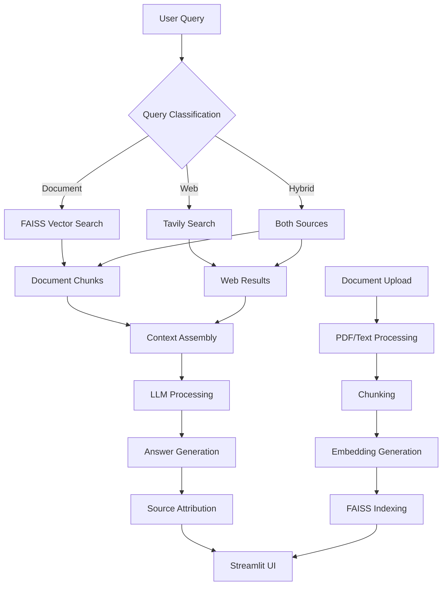

# 🔍 Hybrid RAG Search Engine

**An intelligent multi-document search system that combines local document knowledge with real-time web search for comprehensive, up-to-date answers.**

---

## 🏢 Project Overview

This project was developed as an **Enterprise Knowledge Intelligence Platform** that solves the critical business challenge of information fragmentation. Organizations store valuable knowledge across multiple unstructured documents (PDFs, reports, notes) but often need current, real-world information to make informed decisions.

The Hybrid RAG Search Engine bridges this gap by combining **semantic document search** with **real-time web intelligence**, providing organizations with a single interface to access both their internal knowledge base and external information sources.

---

## 🧠 Core Objectives

- Build a **multi-document semantic search** system using FAISS vector storage
- Integrate **real-time web search** via Tavily for current information
- Implement **intelligent query routing** to determine optimal search strategy
- Create **transparent citation system** distinguishing document vs web sources
- Develop **enterprise-grade UI** using Streamlit for user interaction
- Ensure **answer grounding** with clear source attribution

---

## 🚀 Quick Installation & Setup

### 1. Create Project Directory
```bash
mkdir hybrid-rag-engine
cd hybrid-rag-engine
```
### 2. Set Up Virtual Environment
```bash
python -m venv venv

# Activate on Mac/Linux:
source venv/bin/activate

# Activate on Windows:
venv\Scripts\activate
```
### 3. Install Dependencies
```bash
pip install -r requirements.txt
```
### 4. Configure Environment
- Create a .env file:
```env
GROQ_API_KEY=your_groq_api_key_here
TAVILY_API_KEY=your_tavily_api_key_here
```
### 5. Running the Application
```bash
streamlit run main.py
```
### Access the Interface
- The terminal will display a local URL (typically http://localhost:8501)
- Open this URL in your web browser
- Start searching across documents and the web!
### 🏗️ System Architecture

### 📋 Project Structure
```text
hybrid-rag-engine/
├── main.py              # Main Streamlit application
├── config.py           # Configuration management
├── models.py          # Data models and schemas
├── ingest.py          # Document ingestion pipeline
├── vector_store.py    # FAISS vector database
├── web_search.py      # Tavily search integration
├── rag_engine.py      # Core RAG processing engine
├── requirements.txt   # Dependencies
└── .env              # Environment variables
```
