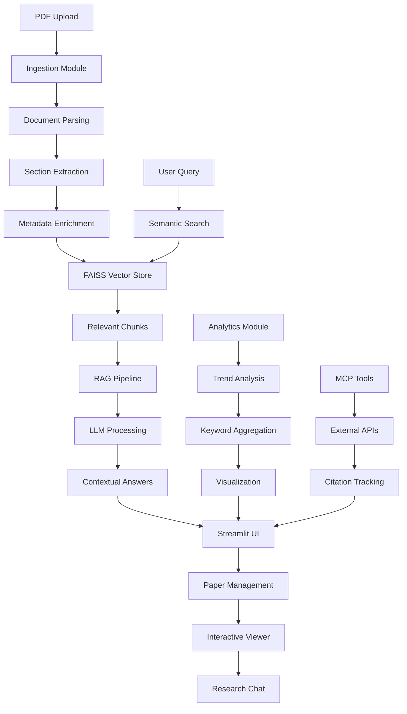

# 🔬 Research Paper Management & Analysis Intelligence System

**An AI-powered research assistant platform that helps researchers discover, organize, analyze, and interact with scientific literature using advanced LLM capabilities.**

---

## 🏢 Project Overview

This project was developed as a comprehensive **Research Intelligence Platform** for academic institutions, research labs, and R&D departments. The system addresses the challenge of information overload in scientific literature by providing intelligent tools for paper discovery, summarization, analysis, and trend identification across domains like AI, healthcare, physics, and finance.

---

## 🧠 Core Objectives

- Build a **unified paper ingestion pipeline** for PDF processing and metadata extraction
- Implement **semantic search** across research literature using FAISS vector storage
- Create **context-aware Q&A systems** with citation tracking capabilities
- Develop **automatic summarization** with structured output formats
- Identify **emerging research trends** through keyword and topic analysis
- Provide an **intuitive researcher-facing UI** using Streamlit
- Integrate **external research tools** via MCP (Model Context Protocol)

---

## 🚀 Quick Installation & Setup

### 1. Create Project Directory
```bash
mkdir research-intelligence-platform
cd research-intelligence-platform
```
### 2. Set Up Virtual Environment
```bash
python -m venv venv

# Activate on Mac/Linux:
source venv/bin/activate

# Activate on Windows:
venv\Scripts\activate
```
### 3. Install Dependencies
```bash
pip install -r requirements.txt
```
### 4. Configure Environment
- Create a .env file:
```env
GEMINI_API_KEY=your_actual_gemini_api_key_here
GROQ_API_KEY=your_groq_api_key_here
```
### 5. Running the Application
```bash
streamlit run app.py
```
### Access the Interface
- The terminal will display a local URL (typically http://localhost:8501)
- Open this URL in your web browser
- Start exploring the research intelligence platform!
### 🏗️ System Architecture

### 📋 Project Structure
```text
research-intelligence-platform/
├── app.py                    # Main Streamlit application
├── ingestion.py             # PDF parsing and data modeling
├── rag_engine.py           # FAISS indexing and RAG pipeline
├── analytics.py            # Trend analysis and MCP tools
├── requirements.txt        # Dependencies
└── .env                   # Environment variables
```
